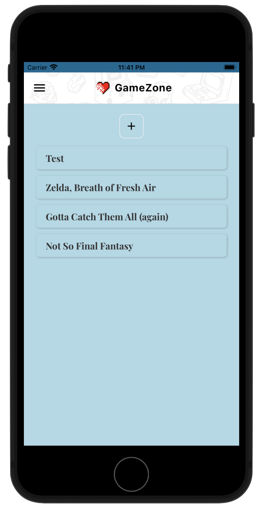

# React Native Playground

This is a play area for React Native

# React Native Tutorial

## 📖 Chapters

1. Introduction
1. Creating a React Native App
1. Views, Text & Styles
1. Using State
1. Text Inputs
1. Lists & ScrollView
1. Flat List Component
1. Touchable Components
1. Todo App (part 1)
1. Todo App (part 2)
1. Todo App (part 3)
1. Alerts
1. Dismissing the Keyboard
1. Flexbox Basics
1. Icons & More Flexbox
1. Starting the Reviews App
1. Custom Fonts
1. Global Styles
1. React Navigation Setup
1. Stack Navigator
1. Navigating Around
1. Passing Data Between Screens
1. Navigation Options
1. Drawer Navigation
1. Custom Header Component
1. Custom Card Component
1. Using Images
1. Background Images
1. Modals
1. Formik Forms (part 1)
1. Formik Forms (part 2)
1. Validation with Yup
1. Showing Form Errors
1. Custom Button Component
1. Wrap Up
